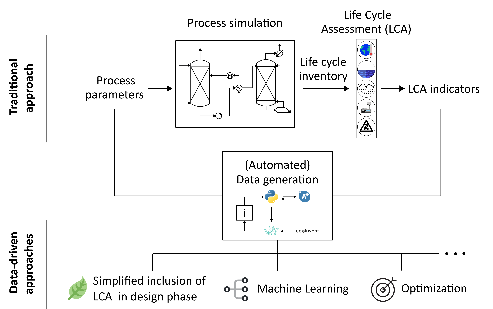
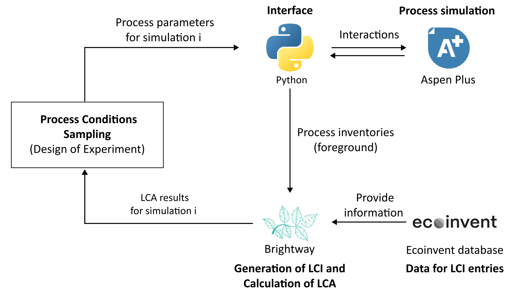

  

  

This Github repository is related to the conference paper "Open-source Automation of Aspen Plus simulation and Life Cycle Assessment for Carbon Capture: From Automation to Intelligent Scenario Optimization" presented on the E2DT 2025 conference in Italy, Palermo. It provides an open-source framework that couples Aspen Plus process simulations with the Python-based Brightway package to conduct Life Cycle Assessments (LCA). The approach is demonstrated on a well-studied, solvent-based post-combustion carbon capture process using Monoethanolamine (MEA) as a case study. Beside the full framework, tutorials are provided, explaining the most important functionalities of the Aspen-Python-Interface and Brightway.

Please note that this ReadMe-file is an early version and will be refined after the conference. In general, we warmly invite you to give us feedback for improving the repository.

Publication: https://doi.org/10.3303/CET25119068
